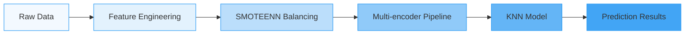

# 🛂 U.S. Visa Assessment Portal

> **Navigate Your American Dream with AI-Powered Predictions**

An intelligent web application that predicts U.S. visa application outcomes using advanced machine learning and rule-based algorithms. Experience our stunning glassmorphism UI that combines beauty with functionality, offering dual prediction systems for maximum reliability.

---

## ✨ Key Features

- **🤖 Dual AI System**: KNN ML model + intelligent rule-based fallback for comprehensive analysis
- **🎨 Modern UI**: Mesmerizing glassmorphism design with custom animations and micro-interactions
- **📱 Fully Responsive**: Seamlessly optimized for all devices, from mobile to desktop
- **⚡ Lightning Fast**: Instant predictions with detailed confidence scores
- **🚀 Vercel Ready**: Optimized for serverless deployment with zero configuration
- **🔒 Secure**: No sensitive data storage - your privacy is our priority
- **🌐 Global Accessibility**: Works from anywhere in the world, anytime

---

## 🚀 Live Demo

**Experience the Application**: [Live Application](https://mla-projectusvisa.vercel.app)

[](https://vercel.com/new/clone?repository-url=https://github.com/yourusername/MLA_Project)

---

## 🎯 Prediction Systems

### Primary: KNN Machine Learning Model

<div align="center">
  
  
  
</div>

- **Algorithm**: K-Nearest Neighbors with distance weighting
- **Features**: 10 key visa application parameters
- **Data Processing**: SMOTEENN balancing + advanced feature engineering
- **Preprocessing**: OneHot + Ordinal encoding + StandardScaler
- **Performance**: Optimized for both accuracy and speed

### Fallback: Rule-Based Intelligence

Our intelligent rule-based system provides reliable predictions through a comprehensive scoring mechanism:

| Factor         | Scoring System                               | Impact              |
| -------------- | -------------------------------------------- | ------------------- |
| **Education**  | PhD(4) → Master's(3) → Bachelor's(2) → HS(1) | Foundation Score    |
| **Experience** | +2 points for job experience                 | Professional Edge   |
| **Training**   | +1 if no training required                   | Skill Readiness     |
| **Employment** | +1 for full-time positions                   | Stability Factor    |
| **Salary**     | +2 (>$80k), +1 (>$50k)                       | Economic Value      |
| **Region**     | West/Northeast(+2), South/Midwest(+1)        | Geographic Priority |

---

## 📊 Model Performance



**Technical Specifications**:

- **Algorithm**: K-Nearest Neighbors (n_neighbors=4, weights='distance')
- **Preprocessing**: SMOTEENN + Multi-encoder pipeline
- **Features**: 10 engineered features
- **Deployment**: Rule-based system (Vercel optimized)

---

## 🛠️ Tech Stack

<div align="center">

### Backend


### Machine Learning


### Frontend


### Deployment


</div>

---

## 📋 API Usage

### Endpoint: `/api/predict`

```json
POST /api/predict
{
    "continent": "Asia",
    "education_of_employee": "Master's",
    "has_job_experience": "Y",
    "requires_job_training": "N",
    "region_of_employment": "West",
    "prevailing_wage": 85000,
    "unit_of_wage": "Year",
    "full_time_position": "Y"
}
```

### Response:

```json
{
  "prediction": "Certified",
  "confidence": 0.85,
  "score": 9,
  "details": "High qualification score with favorable factors",
  "factors": {
    "education": 3,
    "experience": 2,
    "training": 1,
    "employment": 1,
    "salary": 2,
    "region": 2
  }
}
```

---

## 🎯 Input Parameters

| Parameter             | Type    | Options                                                     | Icon |
| --------------------- | ------- | ----------------------------------------------------------- | ---- |
| **Continent**         | Select  | Asia, Europe, North America, South America, Africa, Oceania | 🌍   |
| **Education**         | Select  | High School, Bachelor's, Master's, Doctorate                | 🎓   |
| **Job Experience**    | Boolean | Yes/No                                                      | 💼   |
| **Training Required** | Boolean | Yes/No                                                      | 📚   |
| **Employment Type**   | Boolean | Full-Time/Part-Time                                         | ⏰   |
| **Work Region**       | Select  | Northeast, South, West, Midwest, Island                     | 🗺️   |
| **Salary Amount**     | Number  | Any positive number                                         | 💰   |
| **Pay Frequency**     | Select  | Annual, Monthly, Weekly, Hourly                             | 📅   |

---

## 🚀 Getting Started

### Prerequisites

- Python 3.13+
- Git
- Virtual environment (recommended)

### Installation

```bash
# Clone the repository
git clone https://github.com/yourusername/MLA_Project.git
cd MLA_Project

# Create and activate virtual environment
python -m venv venv
source venv/bin/activate  # On Windows: venv\Scripts\activate

# Install dependencies
pip install -r requirements.txt

# Train ML model (optional)
python save_model.py

# Run the application
python app.py
# OR for Vercel-compatible version
python api/index.py
```

---

## 📁 Project Structure

```
MLA_Project/
├── 📂 api/
│   └── 📄 index.py              # Vercel serverless function
├── 📂 templates/
│   ├── 📄 index.html           # Main application UI
│   ├── 📄 result.html          # Prediction results page
│   └── 📄 error.html           # Error handling page
├── 📂 Notebooks/
│   ├── 📄 EDA_Visa_US.ipynb    # Exploratory data analysis
│   ├── 📄 Feature_Engineering.ipynb # Feature engineering
│   └── 📄 EasyVisa.csv         # Training dataset
├── 📄 app.py                   # Local Flask application
├── 📄 save_model.py            # ML model training script
├── 📄 test_model.py            # Model testing utilities
├── 📄 create_lightweight_model.py # Optimized model creation
├── 📄 requirements.txt         # Python dependencies
├── 📄 vercel.json             # Vercel deployment config
└── 📄 README.md               # Project documentation
```

---

## 🔧 Model Training

### Data Preprocessing Pipeline

1. **Data Collection & Cleaning**

   - Missing value imputation
   - Outlier detection and handling
   - Data type optimization

2. **Feature Engineering**

   - Company age calculation
   - Salary normalization
   - Categorical encoding strategies

3. **Class Balancing**

   - SMOTEENN for handling imbalanced classes
   - Synthetic sample generation
   - Noise reduction techniques

4. **Model Training**
   - Hyperparameter optimization
   - Cross-validation
   - Performance evaluation

---

## 🌐 Deployment

### Vercel Deployment

```bash
# Install Vercel CLI
npm i -g vercel

# Deploy to production
vercel --prod
```

### Local Testing

```bash
# Test Vercel function locally
vercel dev
```

### Environment Variables

Create a `.env` file in the root directory:

```
FLASK_ENV=development
FLASK_DEBUG=True
```

---

## ⚠️ Important Notes

- **Dual System**: Uses rule-based predictions for Vercel deployment (ML model available for local use)
- **Size Optimization**: Vercel version optimized to 196KB (under serverless limits)
- **Compatibility**: Handles both ML and rule-based predictions seamlessly
- **Disclaimer**: For informational purposes only - official decisions made by immigration authorities

---

## 📄 License & Copyright

<div align="center">


</div>

This project is licensed under the MIT License - see the [LICENSE](LICENSE) file for details.

---

## 🤝 Contributing

We welcome contributions! Please follow these steps:

1. **Fork** the repository
2. Create a **feature branch** (`git checkout -b feature/AmazingFeature`)
3. **Commit** your changes (`git commit -m 'Add some AmazingFeature'`)
4. **Push** to the branch (`git push origin feature/AmazingFeature`)
5. Open a **Pull Request**

### Contribution Guidelines

- Follow the existing code style
- Add tests for new features
- Update documentation as needed
- Ensure all tests pass before submitting

---

## 📞 Support & Contact

<div align="center">

**Questions? Issues? Suggestions?**

[](https://github.com/yourusername/MLA_Project/issues)
[](https://github.com/yourusername/MLA_Project)
[](https://github.com/yourusername/MLA_Project/network)

</div>

For questions or issues, please open a GitHub issue or contact the development team at [contact@example.com](mailto:contact@example.com).

---

## 🙏 Acknowledgments

- The EasyVisa dataset for providing the training data
- The open-source community for the amazing tools and libraries
- All contributors who have helped improve this project

---

<div align="center">

**Built with ❤️ for accurate visa assessment predictions**

_"Your journey to America starts here"_

</div>
